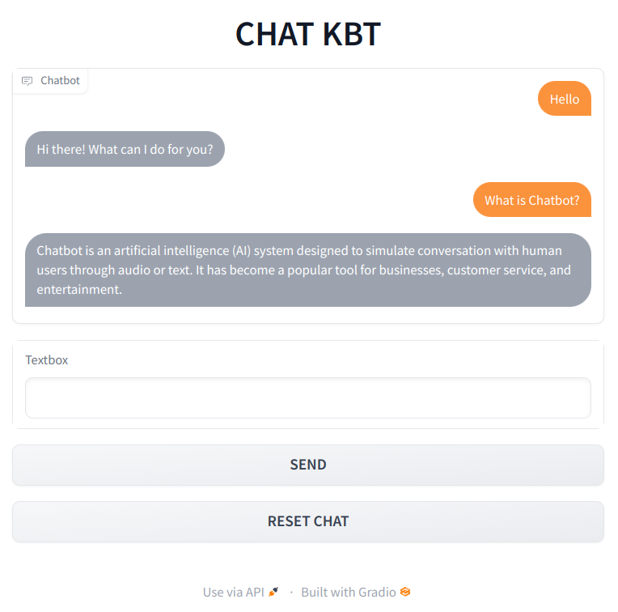

## Chatbot

This is a chatbot built using the "text-davinci-003" model from Open AI which is the used for text generation.

It is not fine tuned for conversation like ChatGPT but it can be used as Chatbot to some extent.

And Gradio is used in this program for building the simple interface to chat.

## Get Started

- You need to get the API Key from Open AI which they provide for free with some credit to use the API
- Setup your key in file "main.py" and execute it. 

### Libraries required

- openai `pip install openai`
- gradio `pip install gradio`

### Use Cases

- Can extend this program to make API and use it in web app or mobile app.
- Can host it as python web app to use via browser too.
- Or can extend this to make telegram or discord bot.

### CohereAI

- Similarly it has another simple bot program which replies for you query with answser.
- It uses "xlarge" model provided by CohereAI which is similar to davinci by OpenAI.
- You can import it using `pip install cohere`, get your apikey and get started
- It is implemented in "chat.py" file of this project folder

